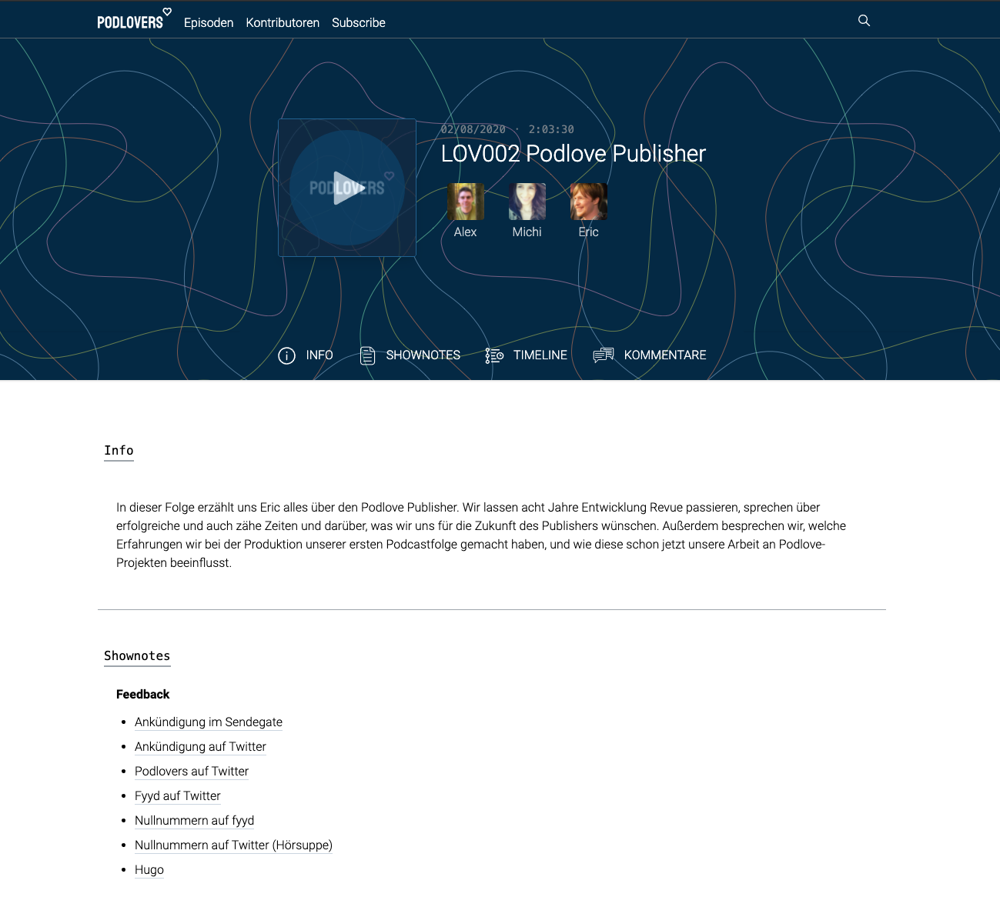

# Podlove Podcast Frontend
> Static frontend generator for Podcast Pages based on [Podlove Publisher](https://de.wordpress.org/plugins/podlove-podcasting-plugin-for-wordpress/) metadata



## Features

- Generates static HTML, JavaScript and CSS that can be hosted anywhere
- Fixed Player that plays while navigating
- Interactive timeline with transcript and chapters support
- Contributor statistics
- Full text search
- Discourse integration

## Requirements

- Podlove Publisher Backend in Version 3.5 or above
- NodeJS 12 or higher

## Setup

1. Checkout this repo
2. Create a custom configuration in `./config`, get inspired by the existing configurations ;)
3. Run `npm install`
4. Run `env NODE_APP_INSTANCE=[config] npm run build`, e.g. `env NODE_APP_INSTANCE=podlovers npm run build`
5. Copy the generated static assets from `dist` to any http(s) server

### Configuration

```javascript
{
  "siteName": "Podlovers", // Name of your site
  "siteTitle": "Podlovers", // Title of tour site
  "siteUrl": "https://podlovers.org", // Url it will be hosted on
  "icon": "./static/favicon.png", // Favicon
  "api": "https://backend.podlovers.org", // Wordpress URL with installed publisher
  "feed": "https://feeds.podlovers.org/mp3", // Feed URL
  "comments": {
    "discourse": "https://community.podlove.org/" // Discourse URL, leave empty to disable the integration
  },
  "header": {
    "logo": "/logo.svg", // Header text logo, leave empty to hide
    "background": "/bg-pattern.png" // Header background, leave empty to disable
  },
  "subscribe-button": [ // Subscribe Button configurations
    {
      "id": "apple-podcasts",
      "service": "id934797989" // https://podcasts.apple.com/podcast/[service]
    },
    {
      "id": "antenna-pod"
    },
    {
      "id": "beyond-pod"
    },
    {
      "id": "castbox",
      "service": "castbox-id"
    },
    {
      "id": "castro"
    },
    {
      "id": "clementine"
    },
    // {
    //   "id": "deezer",
    //   "service": "https://www.deezer.com/en/show/[service]"
    // },
    {
      "id": "downcast"
    },
    {
      "id": "google-podcasts",
      "service": "https://forschergeist.de/feed/m4a/" // feed
    },
    {
      "id": "gpodder"
    },
    {
      "id": "itunes"
    },
    {
      "id": "i-catcher"
    },
    {
      "id": "instacast"
    },
    {
      "id": "overcast"
    },
    {
      "id": "player-fm"
    },
    {
      "id": "pocket-casts"
    },
    {
      "id": "pocket-casts",
      "service": "https://forschergeist.de/feed/m4a/" // feed
    },
    {
      "id": "pod-grasp"
    },
    {
      "id": "podcast-addict"
    },
    {
      "id": "podcast-republic"
    },
    {
      "id": "podcat"
    },
    {
      "id": "podscout"
    },
    {
      "id": "rss-radio"
    },
    // {
    //   "id": "soundcloud",
    //   "service": "", // https://soundcloud.com/[service]
    // },
    // {
    //   "id": "spotify",
    //   "service": "", // https://open.spotify.com/show/[service]
    // },
    // {
    //   "id": "stitcher",
    //   "service": "" // https://www.stitcher.com/podcast/[service]
    // },
    // {
    //   "id": "youtube",
    //   "service": "" // https://www.youtube.com/channel/[service]
    // },
    {
      id: "rss"
    }
  ],

  "theme": { // tip: try https://tailwind.ink/ or http://sitehero.nl/uicolors/# to create your palette
    "colors": {
      "primary": {
        "100": "#F2F8FB",
        "200": "#D9EBF8",
        "300": "#B0D7F4",
        "400": "#87C0EA",
        "500": "#67A8D7",
        "600": "#438ABE",
        "700": "#216190",
        "800": "#0C4168",
        "900": "#042944"
      },
      "secondary": {
        "100": "#F5FDF5",
        "200": "#E2F4E0",
        "300": "#B7E0B3",
        "400": "#98CC92",
        "500": "#79B273",
        "600": "#579750",
        "700": "#396E34",
        "800": "#285424",
        "900": "#072804"
      },
      "complementary": {
        "100": "#FFF8F6",
        "200": "#FEE5DE",
        "300": "#FFBFAD",
        "400": "#F9997D",
        "500": "#F97751",
        "600": "#CA5D3D",
        "700": "#9B4127",
        "800": "#72301C",
        "900": "#341209"
      },
      "gray": {
        "100": "#FFFFFF",
        "200": "#EDEFF2",
        "300": "#CAD1D7",
        "400": "#9EA5AC",
        "500": "#767F87",
        "600": "#56616A",
        "700": "#3D464D",
        "800": "#22282C",
        "900": "#070809"
      }
    }
  }
}

```

### Discourse Integration

The discouse integration is based on the iframe solution and requires some configuration on the disourse site as well. See this tutorial for more information: [Embedding Discourse Comments via Javascript](https://meta.discourse.org/t/embedding-discourse-comments-via-javascript/31963)

## Technology

- [Gridsome](https://gridsome.org/) - Static Site Generator based on VueJS
- [@podlove/source-publisher](https://github.com/podlove/source-publisher) - Gridsome compatible metadata adapter
- [Tailwind](https://tailwindcss.com/) - CSS Framework
- [Podlove UI](https://github.com/podlove/podlove-ui) - Podlove UI components and player logic
## Contribution and Development

If you want to contribute or customize the Podlove Podcast Frontend you should fork this repository. After the initial setup you can spawn the development mode by running the following command:

```bash
env NODE_APP_INSTANCE=[config] npm run build
```

Access `http://localhost:8080/` the development page or have a look at the GraphQL explorer: `http://localhost:8080/___explore`

## Upcoming

1. Docker Container for easy setup
2. Visual configuration interface
